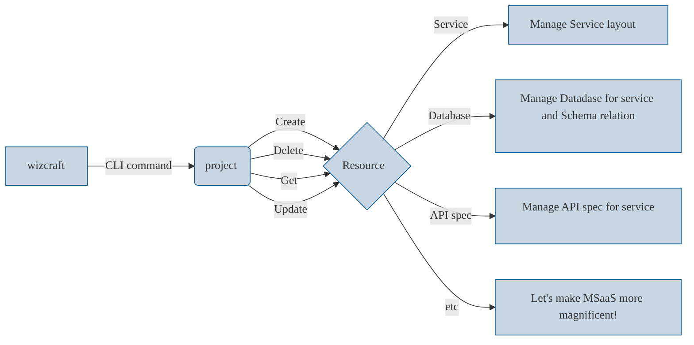

# Working In microservice Zone: Craft a microservice project

<p align="center"></p>

---

(문서 작업 중 … )

wizcraft tool 은 손쉽게 마이크로서비스 프로젝트를 관리하기 위한 CLI 도구 입니다. 

docker container 기반으로 서비스를 배포할 수 있고, 서비스 별 데이터베이스와 스키마 그리고 API 명세를 관리할 수 있습니다.

---



---

### 0. `wizcraft project`

```bash
# setup cli to watch project
$ wizcraft project on [project name]
-> wizcraft handle [project name]
if you change the project of MSaaS, Please type command again for different project.

# get projects status
$ wizcraft project get [project name]
-> Status of project [project name] ...
[count of microservice on project] services configured
- healthy running : [count of healthy status] 
- unhealthy running : [count of unhealthy status]

[count of Database on project] databases configured
- healthy running : [count of healthy status] 
- unhealthy running : [count of unhealthy status]

...

# change project default setting
$ wizcraft project set -f config.yaml
```

### 1. `wizcraft create service [service name]`

```bash
# service is 

$ wizcraft create service [service name]
-> service [service name] is created on [project name] ...
project saves on path [localpath]
If you want to more details, please visit UI console.

$ wizcraft get service layout [service name]

[service name]/
│
├── services/
│   ├── service1/
├── main.go
├── Dockerfile
├── go.mod
├── go.sum
└── ...

$ wizcraft get service metric [service name]

CPU : [number of cpu rate of service] (%) 
Mem : [number of memory usage] (MB/GB)
```

options :

| short ( - o ) | long ( -- option ) | type (string, int , … ) | example |
| --- | --- | --- | --- |
| p | path | string | project local path (ex: -p /root/my_project) |
|  |  |  |  |

### 2. `wizcraft create database [service name]`

```bash
# wizcraft use 'ent. An entity framework for Go' (https://entgo.io/) for manage database system

$ wizcraft create database [service name]
-> postgresql database created for [service name]
Please check your service repository 
```

| short ( - o ) | long ( -- option ) | type (string, int , … ) | example |
| --- | --- | --- | --- |
| s | source | string | kind of database (ex: postgresql, mysql, … ) |
| f | file | string | yaml config file (ex: config.yaml) |

### 3. `wizcraft create apispec [service name]`

```bash
# wizcraft use OpenApi 3.0 for managing apispec of service 
# If you create API spec in yaml file, then wizcraft automatically generate OpenApi docs and go files
# Supported API method is JSON & gRPC 

$ wizcraft create api [service name]
```

| short ( - o ) | long ( -- option ) | type (string, int , … ) | example |
| --- | --- | --- | --- |
| m | method | string | json or gRPC |
|  |  |  |  |
